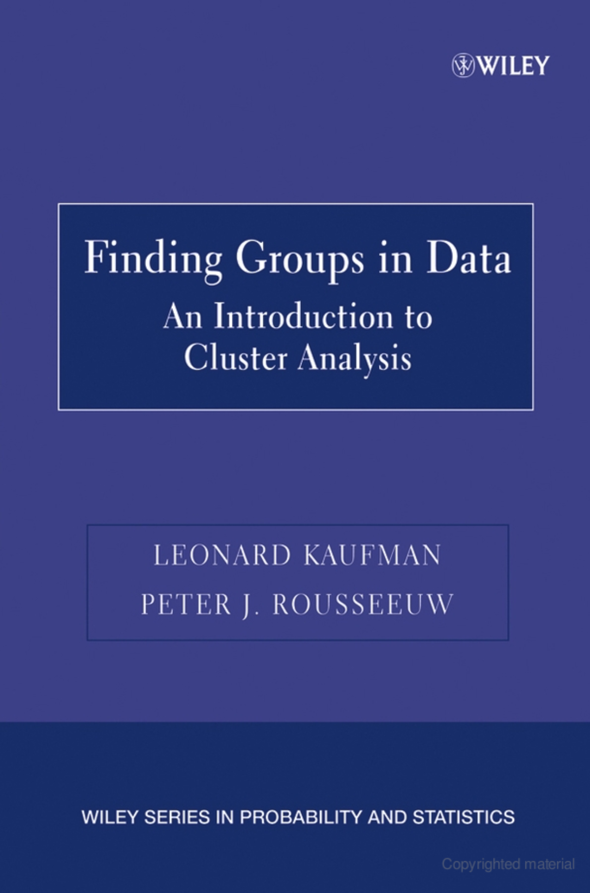

```{r setup, include=FALSE}
knitr::opts_chunk$set(echo = FALSE)
library(cluster)
```

## cluster package
One of `r nrow(installed.packages(priority = "recommended"))` recommended packages

```{r}
row.names(installed.packages(priority = "recommended"))
```

## Cluster package based on...
<div class="columns-2">
[Finding Groups in Data](https://onlinelibrary.wiley.com/doi/book/10.1002/9780470316801) 

An Introduction to Cluster Analysis. 

by Kaufman and Rousseeuw

{ width=50% }


Originally implemented in `CLUSFIND` fortran library, then *S*, then *R*

 
See the PDF documentation. [Clustering in an Object-Oriented Environment](https://www.jstatsoft.org/article/view/v001i04/clus.pdf)
</div> 
## Clustering Methods

### *agnes* : Agglomerative Nesting
### *clara* : Clustering Large Applications
### *daisy* : Dissimilarity Matrix Calculation
### *diana* : DIvisive ANAlysis Clustering
### *fanny* : Fuzzy Analysis Clustering
### *mona* : MONothetic Analysis Clustering of Binary Variables
### *pam* : Partitioning Around Medoids


## Partitioning methods
+ Divide dataset into k clusters. (k is defined by researcher)
+ pam, clara, fanny

```{r, echo=TRUE}
pam(agriculture, k=2)
```

## Partitioning methods
+ Divide dataset into k clusters. (k is defined by researcher)
+ pam, clara, fanny

```{r, echo=TRUE}
plot(pam(agriculture, k=2))
```


## Hierarchical methods
+ Start with cluster of one item, then build larger clusters (or the opposite)
+ agnes, diana, mona

```{r, echo=TRUE}
agnes(agriculture)
```

## Hierarchical methods
+ Start with cluster of one item, then build larger clusters (or the opposite)
+ agnes, diana, mona

```{r, echo=TRUE}
plot(agnes(agriculture), which.plots = 2)
```

## Dissimilarity

daisy creates a dissimilarity matrix
```{r, echo=TRUE}
daisy(head(agriculture))
```

## Summary

+ cluster package is already `installed.packages()`
+ still requires `library(cluster)`
+ provides several well-documented clustering methods