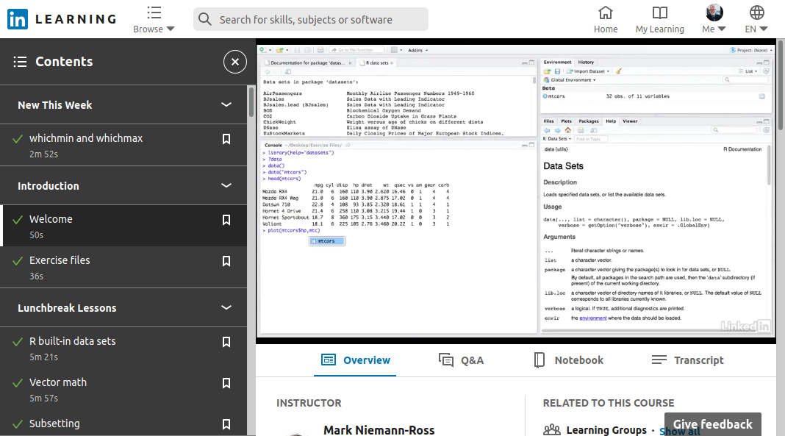

```{r setup, include=FALSE}
knitr::opts_chunk$set(echo = FALSE)
library(qrcode)

# define two matrices
A <- matrix( c(1:9), nrow = 3)
B <- matrix( c(11:19), nrow = 3)

# silly functions
tookLinearAlgebra <- function(a){a}
paidAttention <- function(a){a}
understoodIt <- function(a){a}

```
 
## 300 lessons later | What I've learned about R ... from teaching R

<div class="columns-2">

{ width=70% }

[Mark Niemann-Ross](https://www.linkedin.com/in/markniemannross/)


I've taught about 300 sessions on the R language 

for LinkedIn Learning 

(formerly Lynda.com)

</div>


## For Example...

{ width=90% }

## For Example: Matrix Math Review
<div class="columns-2">

```{r, echo=TRUE}

A + B

A - B

A * B # simple multiplication

A %*% B # Dot Product 

```
</div>
*extra credit: what is A? what is B?

## What I've learned

- R is strange
- R is deep
- Tidyverse and Base R
- Dates and Times Hurt
- R Trends
- Imposter Syndrome
- Unpacking Knowledge
- Teaching R is different than Using R
- R vs Python
- The R community is AWESOME


## Lesson: R is strange


```{r, echo=TRUE}
if (tookLinearAlgebra(TRUE) & paidAttention(TRUE) & understoodIt(TRUE) ) {
  "R makes sense"
}
```


## Lesson: R is strange
*...BUT...*

for the rest of us, R is just wrong.

Terms in Every Other Language | Terms in R
---|----
Variable | 1D Vector (**WAT??**)
Array | Vector
2D Array | Matrix
3D Array (or more) | Array
List | List
Spreadsheet | Data.frame or tibble

## Lesson: R is strange

...And what about...

`apply()`, `lapply()`, `tapply()`, `mapply()`, `sapply()`, `vapply()`, `rapply()`

...instead of...

`for (variable in vector) {}`

...and what about **vectorization** ?


## Lesson: R is strange
Because of these terms and data structures\
learning R requires you to relearn programming.
\
\
It's a *crappy* beginner language...
\
\
...and it's a *crappy* second language.
\
\
...but it's a *great* language.

## Lesson: R is deep

There is a [lot of R](https://cran.r-project.org/doc/manuals/r-release/fullrefman.pdf) you may not know about

*~ 1,500 functions in Base R*

There is a lot of R you will never use

There is a bit of R that will change your world and make you a rock star


## Example: Three Graphics Environments
**1. Base R**

plot, barplot, boxplot, cdplot, coplot, dotchart, fourfoldplot, 
heatmap, hist, matlines,matplot, mosaicplot, pie, spineplot, 
stemplot, stripchart, sunflowerplot

**2. ggplot**

Tidyverse package for grammar of graphics. VERY popular

**3. lattice**

+ included with R. *recommended package*. Faster than ggplot, 
+ better awareness of output device. 
+ barchart, bwplot, densityplot, dotplot, histogram, qqmath, stripplot, qq, xyplot, levelplot, contourplot, cloud, wireframe, splom, parallel, rfs, tmd

## Example: Lattice

```{r, echo=TRUE, fig.height=3}

library(lattice)

xyplot( weight ~ Time, data = ChickWeight, type = "a")
```

Note the use of formula instead of "x =" and "y="

## Lesson: Tidyverse and Base R

Tidyverse is great, but ...

**Familiarity**

+ Tidyverse is one more thing to learn
+ What is the shop standard tool?
+ Tidyverse is not a universal standard.

**Alternatives**

+ [Base R Packages](https://cran.r-project.org/web/packages) and [Tasks](https://cran.r-project.org/web/views/)
+ [Bioconductor](https://www.bioconductor.org/) (Specialized Genomics - and [more](https://www.bioconductor.org/packages/release/bioc/html/EBImage.html))
+ [Microsoft R Open](https://mran.microsoft.com/open) (with built-in package management)

## Lesson: Dates and Times Hurt

**There are three main Base R date structures**

- Date *(only stores dates)*
- POSIXct *(stores dates AND times as seconds)*
- POSIXlt *(stores dates AND times as list)*

**and two more...**

- chron
- difftime

... and yes, there is [lubridate](https://lubridate.tidyverse.org/)

## Example: Dates and Times

```{r, echo=TRUE}
HAL_online <- as.Date("1992-01-12")

as.numeric(HAL_online) # produces DAYS, not SECONDS
```

```{r, echo=TRUE}
myPOSIXct <- as.POSIXct("March 14, 2015 at 9:26", format = "%B %d, %Y at %H:%M")

as.integer(myPOSIXct) # Seconds between midnight 1-Jan-1970 and 14-Mar-2015 at 9:26 am
```

```{r, echo=TRUE}
myPOSIXlt <- as.POSIXlt("March 14, 2015 at 9:26", format = "%B %d, %Y at %H:%M")

myPOSIXlt[1, "year"] # POSIXlt is a list. Here is years since 1900
```


## R Trends

### Short function courses are more popular than long concept courses

- R users want *tools* rather than programming theory
- *If it works, it's done*
- I suspect very little R code is groomed or maintained


## Lesson: Imposter Syndrome

**Don't doubt your skills - You're not a fraud**

{ width=50% }


## Lesson: Imposter Syndrome

{ width=70% }

## Lesson: Imposter Syndrome

She was a PhD in Computer Science. She **couldn't be** any more qualified!
\
\
Perhaps she didn't feel supported. Which is something we need to change.
\
\


## Lesson: Unpacking Knowledge 

Data Science is **telling stories** and **visualizing numbers**


<div class="columns-2">
What is your point?

Why should anyone care?

Use less to tell more

Don't be impressed with everything you know

Bury the backstory

  
 </div>

## Example: Unpacking Knowledge


## Lesson: Teaching R is different than Using R

```{r, echo=TRUE}
plot(unlist(lapply(split(ChickWeight[,1], ChickWeight[,3]), median)))
```

## Lesson: Teaching R is different than Using R

```{r, echo=TRUE}
mySplit <- split(ChickWeight$weight, ChickWeight$Chick)
myMedian <- lapply(mySplit, median)
plot(unlist(myMedian), xlab = "Chick", ylab = "Median Weight")
```

## Lesson: R vs Python

### R programmers behave differently than Python programmers
\
\
<div class="columns-2">


</div>
\
\

## Lesson: R vs Python

### You see this in:

**Documentation**

- Python is spacious and written in "programmerese"
- R looks to be written by PhD candidates

**Style Guides**

- Python: PEP 8, Google, "pythonic"
- R: Hadley and the Tidyverse (Google R is a fork of tidyverse)

**Playfulness**

- Python is named after Monty Python
- R is ... well ... 

## Lesson: The R community is AWESOME

- Boston useR
- [RLadies](https://rladies.org/)
- [R Consortium](https://www.r-consortium.org/)

## Q & A

[This presentation on github](https://github.com/mnr/R-for-Data-Science-Lunchbreak-Lessons/tree/master/GreaterBostonUseR)

```{r}
qrcode_gen("https://www.linkedin.com/in/markniemannross/")
```

## A and B
```{r, echo=TRUE}
A <- matrix( c(1:9), nrow = 3)
A
B <- matrix( c(11:19), nrow = 3)
B

```

